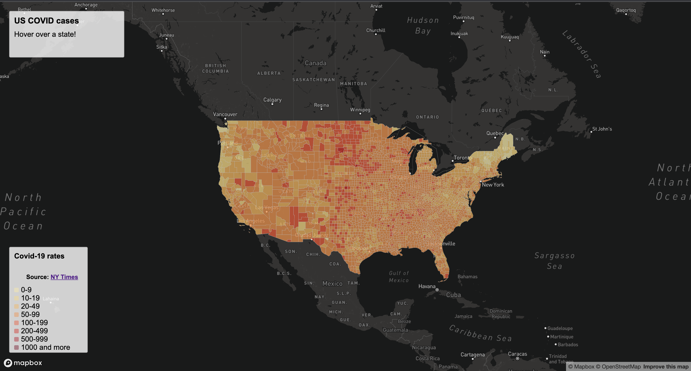
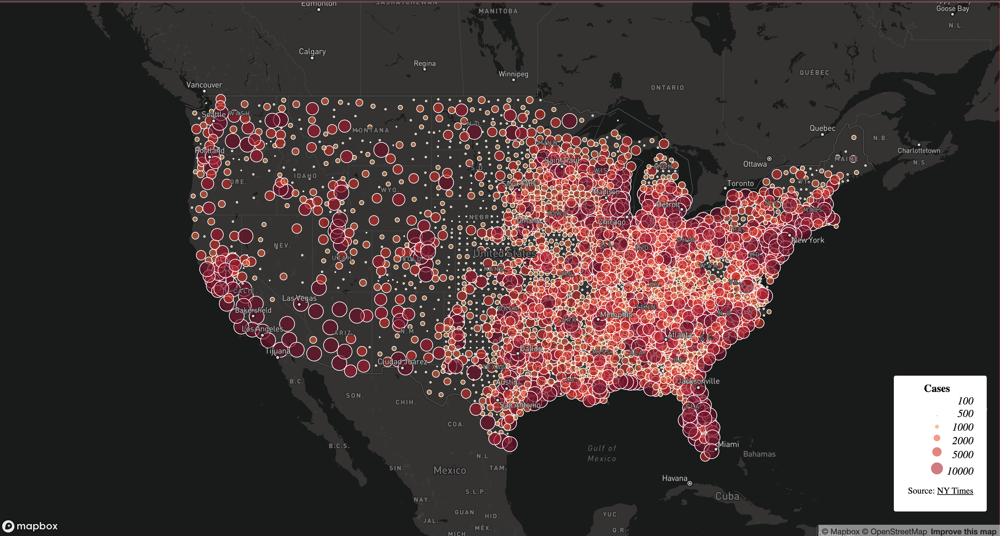

# geog458
## Travis Le
## COVID 19 thematic maps

For this lab deliverable, we need to create two thematic maps, one is a choropleth map of the covid-19 rates and the other is a proportional symbols map of covid-19 cases.

- The first [map](map1.html) is a choropleth map about the covid-19 rates.

- The second [map](map2.html) is a proportional symbols map of covid-19 cases.

The COVID-19 case/death data we used for this deliverable are originally from [The New York Times](https://github.com/nytimes/covid-19-data/blob/43d32dde2f87bd4dafbb7d23f5d9e878124018b8/live/us-counties.csv). The data include all the cases in 2020. The population data used for calculating the case rates are from the [2018 ACS 5 year estimates](https://data.census.gov/cedsci/table?g=0100000US.050000&d=ACS%205-Year%20Estimates%20Data%20Profiles&tid=ACSDP5Y2018.DP05&hidePreview=true). Both data are at the county level. The U.S. county boundary shapefile was downloaded from [the U.S. Census Bureau](https://www.census.gov/geographies/mapping-files/time-series/geo/carto-boundary-file.html). The data have been processed by us in order to suit the purpose of this lab. The case rate is calculated as cases per thousand residents.